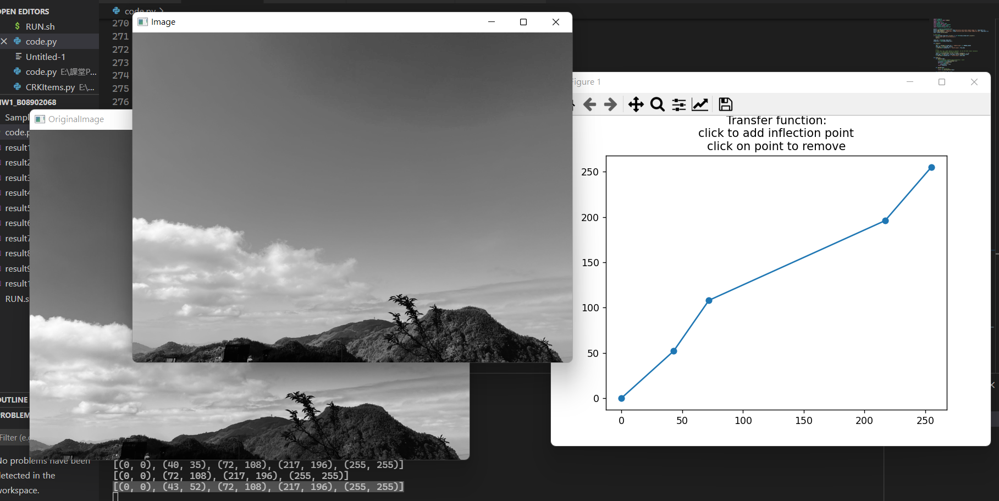

# Image-Transfer-Function-Drawer-GUI



```
    A GUI to draw & apply a piecewise linear transfer function to an image.
    
    Click on transfer function to add an inflection point.
    CLick on point to remove that inflection point.

    Press "m" to save image to output path (set in `--output`).
    Press "q" to exit the program.
```

## What is this?
In computer vision, we need to do image enhancement, e.g. contrast manipulation, histogram equalization, etc.

We will have to design transfer functions to manipulate an image's intensity values. A transfer function is basically a mapping from original image's pixel intensity value to new image's intensity value.

Although transfer functions is often designed and calculated by a predetermined & mechanical approach (e.g. linear scaling & clipping, power-law, logarithmic point transformation, etc), one may need to find your custom transfer function. Since trying out loads of predetermined transfer function is quite tedious and you may still not know what function suits you best, this GUI is here for your help.

Basically, **this GUI can let you "draw" any piecewise-linear transfer function** (or rubber-band transfer function, if you prefer). The result image will immediately be shown in a window `Image`, while the original image is shown in window `OriginalImage` for your reference.
This is to help you to understand what kind of transfer function you need, by playing with simple, piecewise-linear functions first. For example, when you play around with (or draw) different transfer functions, you may find out that adding contrast to intensity range 50~70 is beneficial, then you can design or find other functions that utilize this fact.

But since piecewise linear transfer function can simulate any transfer function if you add enough inflection points, you could use the result image as your final result too, to avoid the necessity of designing a matching transfer function.

Note that for now, intensity 0 must be mapped to 0, 255 must be mapped to 255. I think this is standard enough, but it would mean it cannot do things like brightness adjustment by multiplication (e.g. make brightness x0.5), at least not properly. You could still simulate it by putting points close to (0, 0) and (255, 255).

## How to use?
```
$ python transferFunctionDrawer.py -h
usage: transferFunctionDrawer.py [-h] -i INPUT [-o OUTPUT] [--inflect INFLECT] [-g]

    A GUI to draw & apply a piecewise linear transfer function to an image.
    
    Click on transfer function to add an inflection point.
    CLick on point to remove that inflection point.

    The inflection points will be printed on change to transfer function,
    and you can store it and import by option `--inflect`

    Press "m" to save image to output path (set in `--output`).
    Press "q" to exit the program.

options:
  -h, --help            show this help message and exit
  -i INPUT, --input INPUT
                        Image to apply transfer function
  -o OUTPUT, --output OUTPUT
                        Output path of saved image,
                        if it is not set, then will not be able to save.
  --inflect INFLECT     Load inflection points from before. e.g. "[(0, 0), (128, 32), (255, 255)]".
                        Must all be contained in a single string, with format like above.
                        You can directly import it if you have the previous inflection point output of program.
  -g, --grey            Use grey image (i.e. read by cv2.IMREAD_GRAYSCALE)
                        Default to color version (i.e. read by cv2.IMREAD_COLOR)
```

## Reference
+ https://matplotlib.org/stable/users/explain/event_handling.html

I refined the example in this guide to make the main `matplotlib` GUI work as intended. The class `TransferFunctionDrawer` is originally called `LineBuilder`.
